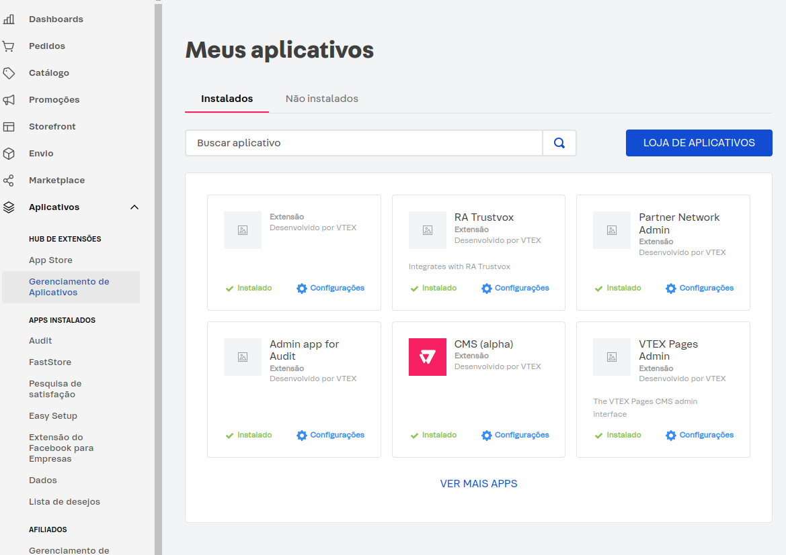

<h1>
  
</h1>

> Veja a documentação em Inglês [aqui](./docs/README_EN.md).

O plugin Trustvox VTEX IO é uma solução de integração entre a plataforma de e-commerce VTEX IO e a plataforma de avaliações RA Trustvox. Ele permite que lojistas exibam widgets de avaliação de produtos e o selo de confiança diretamente em suas páginas, enriquecendo a experiência do usuário e aumentando a credibilidade da loja. 


## Instalação do plugin

Para instalar o plugin da trustvox para VTEX IO siga os seguintes passos:

### Pré-requisitos

- [Node JS](https://nodejs.org/en/download)
- [VTEX IO CLI](https://developers.vtex.com/docs/guides/vtex-io-documentation-vtex-io-cli-install)

### Instalação

1. Para clonar o projeto, rode o seguinte comando:

```
git clone https://github.com/trustvox/trustvox-vtex-io-plugin.git
```

2. No arquivo [manifest.json](./manifest.json), altere o valor de `vendor` com o nome da conta vtex que está realizando a instalação.
   
OBS: O nome da conta está presente na URL myvtex, Exemplo:https://{account}.myvtex.com

3. Abra o terminal na pasta deste projeto, e siga os seguintes passos:

- Execute o seguinte comando para fazer login na conta VTEX:
   
```
vtex login {account}
```

Substitua o `{account}`

- Execute o seguinte comando para publicar o aplicativo no repositório de aplicativos da VTEX:

```
vtex publish
```

- Execute o seguinte comando para instalar o aplicativo:

```
vtex install
```

Após isso você deve ser capaz de encontrar o aplicativo RA Trustvox na sessão de `Gerenciamento de aplicativos` no seu painel da VTEX.



4. Agora é necessário configurar o aplicativo RA Trustvox no painel administrativo da VTEX. Para isso siga os seguintes passos:

- Na sessão de `Gerenciamento de aplicativos` do painel da VTEX, selecione o aplicativo RA Trustvox, você deve visualizar a seguinte tela:


- Preencha o campo `Store ID` com o **ID da sua loja**. Você pode encontrar seu ID menu preferências no [Painel administrativo da Trustvox](https://app.trustvox.com.br/auth/login), na página da empresa:


### ⚠️ Caso seja necessário a validação no ambiente de homologação é necessário ativar a opção `Habilitar ambiente de testes` e informar o ID da loja de do ambiente de testes da trustvox.

5. Após a instalação, vá até o projeto da sua loja (store-theme) e edite o arquivo `manifest.json`, nas dependências do projeto adicione a dependência do aplicativo da trustvox.

```json
{
  ...
   "dependencies": {
    ...
    "{account}.trustvox": "0.x",
    ...
   } 
  ...
}
```

Substitua o `{account}` pela sua conta vtex.

Suba as alterações para sua loja, após isso, você irá conseguir adicionar os blocos do aplicativo RA Trustvox.

## Ativar agrupamento de produto

- Localize e selecione o aplicativo RA Trustvox. A tela de configuração do aplicativo será exibida como mostrado abaixo:


- Marque a caixa de seleção Habilitar Espelhamento de Reviews para ativar o agrupamento de produtos.

- Clique no botão Salvar para aplicar as alterações.

## Configuração dos blocos

Este aplicativo disponibiliza substitui os blocos de [Reviews de produto](https://github.com/vtex-apps/product-review-interfaces/tree/master/example) e também disponibiliza outros blocos.

Após a instalação você poderá adicionar os seguintes blocos as suas páginas:

### bloco: product-rating-inline

Este bloco pode ser adicionado nas prateleiras de produtos. Ele renderiza o widget que lista as média de avaliações por estrela quantidade de comentários para o produto que está sendo visualizado.


### bloco: product-rating-summary

Este bloco pode ser adicionado à página do produto (`store.product`). Ele renderiza o widget que lista média de avaliações por estrela e a quantidade de comentários para o produto que está sendo visualizado.


### bloco: product-reviews

Este bloco pode ser adicionado à página do produto (`store.product`) e renderiza o widget principal que lista quaisquer comentários ou perguntas respondidas para o produto que está sendo visualizado, bem como um formulário para fazer uma nova pergunta, se o produto não tiver a pergunta ou review, ele será exibido como visto na loja.


### bloco: certificate-ratrustvox

Este bloco renderiza o widget de certificado de *Reviews Verdadeiros*, você pode ver mais sobre [aqui](https://help.trustvox.com.br/pt-BR/articles/5551970-como-adicionar-e-exibir-o-selo-de-reviews-verdadeiros-no-seu-site).


### bloco: colt-ratrustvox

Este bloco renderiza o widget de *Carrossel de opiniões*, você pode ver mais sobre [aqui](https://help.trustvox.com.br/pt-BR/articles/5557670-como-adicionar-as-opinioes-de-loja-carrossel-da-ra-trustvox-em-seu-site).


## API de estilos

Este aplicativo fornece algumas classes CSS como uma API para personalização de estilo.

Para usar esta API CSS, você deve adicionar o `styles` builder e criar um arquivo CSS de estilo de aplicativo e adicionar `{account}.trustvox` ao seu tema `dependencies`.


1. Adicione o `styles` builder ao seu `manifest.json`:

```json
  "builders": {
    "styles": "1.x"
  }
```

2. Adicione `{account}.trustvox` ao `dependencies` no seu `manifest.json`:

```json
  "dependencies": {
    "{account}.trustvox": "0.x"
  }
```

3. Crie um arquivo chamado `{account}.trustvox.css` dentro da pasta `styles/css`. Adicione seus estilos personalizados: 

```css
.container {
  margin-top: 10px;
}
```

## Disponibilização para produção

Após realizar os testes de integração com a plataforma RA Trustvox, abra o terminal na pasta deste projeto e execute o seguinte comando para disponibilizar o aplicativo da trustvox para poder ser usado em produção:

```
vtex deploy
```

## Links úteis

[Requisitos e primeiros passos - Plataforma VTEX / VTEX IO](https://help.trustvox.com.br/pt-BR/articles/5551917-requisitos-e-primeiros-passos-plataforma-vtex-vtex-io)

[Acessos necessários para integração na plataforma VTEX](https://help.trustvox.com.br/pt-BR/articles/5560780-acessos-necessarios-para-integracao-na-plataforma-vtex)

[Como exibir as opiniões da RA Trustvox na plataforma VTEX IO](https://help.trustvox.com.br/pt-BR/articles/6726517-como-exibir-as-opinioes-da-ra-trustvox-na-plataforma-vtex-io)
