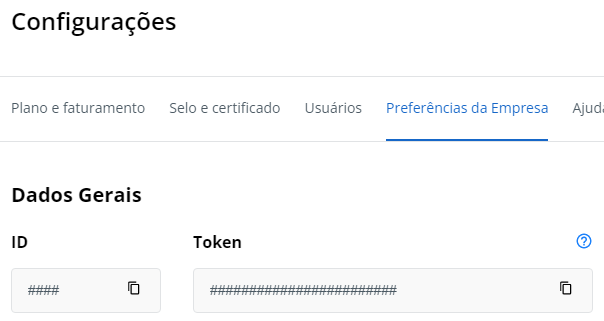
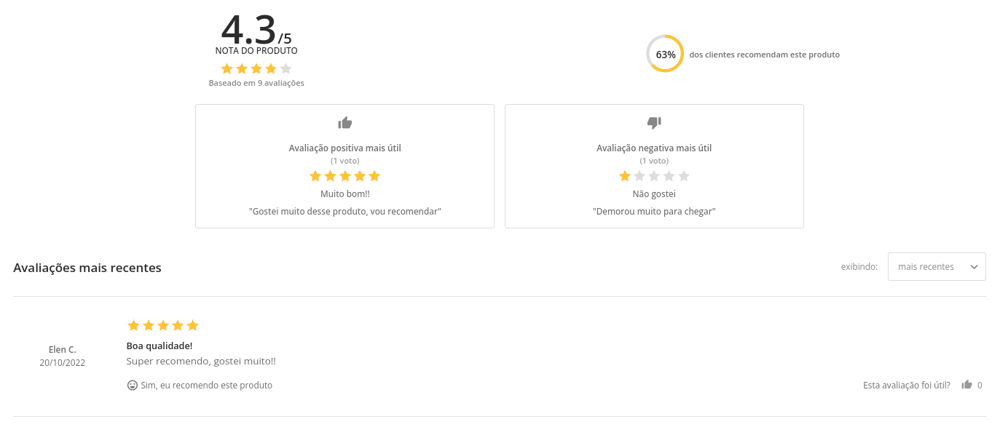

<h1>
  
</h1>

The Trustvox VTEX IO plugin is an integration solution between the VTEX IO e-commerce platform and the RA Trustvox review platform. It allows merchants to display product review widgets and the trust seal directly on their pages, enriching the user experience and increasing store credibility.


## Plugin Installation

To install the Trustvox plugin for VTEX IO, follow these steps:

### Prerequisites

- [Node JS](https://nodejs.org/en/download)
- [VTEX IO CLI](https://developers.vtex.com/docs/guides/vtex-io-documentation-vtex-io-cli-install)

### Installation

1. To clone the project, run the following command:

```
git clone https://github.com/trustvox/trustvox-vtex-io-plugin.git
```

2. In the [manifest.json](../manifest.json) file, change the value of `vendor` to the name of the VTEX account that is performing the installation.

NOTE: The account name is present in the myvtex URL, Example: https://{account}.myvtex.com

3. Open the terminal in this project's folder, and follow these steps:

- Execute the following command to log in to the VTEX account:
   
```
vtex login {account}
```

Replace `{account}`

- Execute the following command to publish the app in the VTEX app repository:

```
vtex publish
```

- Execute the following command to install the app:

```
vtex install
```

After this, you should be able to find the RA Trustvox app in the `App Management` section in your VTEX dashboard.


4. Now it's necessary to configure the RA Trustvox app in the VTEX administrative panel. For this, follow these steps:

- In the `App Management` section of the VTEX dashboard, select the RA Trustvox app, you should see the following screen:


- Fill in the `Store ID` field with your **store ID**. You can find your ID in the preferences menu in the [Trustvox Admin Panel](https://app.trustvox.com.br/auth/login), on the company page:



### ⚠️ If validation in the homologation environment is necessary, it is required to activate the `Enable test environment` option and provide the store ID of the Trustvox test environment.

5. After installation, go to your store's project (store-theme) and edit the `manifest.json` file, in the project dependencies add the Trustvox app dependency.

```json
{
  ...
   "dependencies": {
    ...
    "{account}.trustvox": "0.x",
    ...
   } 
  ...
}
```

Replace {account} with your VTEX account.

Upload the changes to your store, after this, you will be able to add the RA Trustvox app blocks.

## Block Configuration

This app provides replacements for the [Product Reviews](https://github.com/vtex-apps/product-review-interfaces/tree/master/example) blocks and also provides other blocks.

After installation, you can add the following blocks to your pages:

### block: product-rating-inline

This block can be added to product shelves. It renders the widget that lists the average star ratings and the number of comments for the product being viewed.


### block: product-rating-summary

This block can be added to the product page (`store.product`). It renders the widget that lists the average star ratings and the number of comments for the product being viewed.


### block: product-reviews

This block can be added to the product page (`store.product`) and renders the main widget that lists any comments or answered questions for the product being viewed, as well as a form to make a new question, if the product does not have the question or review, it will be displayed as seen in the store.



### block: certificate-ratrustvox

This block renders the True Reviews certificate widget, you can see more about [here](https://help.trustvox.com.br/pt-BR/articles/5551970-como-adicionar-e-exibir-o-selo-de-reviews-verdadeiros-no-seu-site).


### bloco: colt-ratrustvox

This block renders the Opinions Carousel widget, you can see more about [here](https://help.trustvox.com.br/pt-BR/articles/5557670-como-adicionar-as-opinioes-de-loja-carrossel-da-ra-trustvox-em-seu-site).


## Style API

This app provides some CSS classes as an API for style customization.

To use this CSS API, you must add the styles builder and create an app style CSS file and add `{account}.trustvox` to your theme `dependencies`.


1. Add the `styles` builder to your `manifest.json`:

```json
  "builders": {
    "styles": "1.x"
  }
```

2. Add `{account}.trustvox` to `dependencies` in your `manifest.json`:

```json
  "dependencies": {
    "{account}.trustvox": "0.x"
  }
```

3. Create a file named `{account}.trustvox.css` inside the `styles/css` folder. Add your custom styles:

```css
.container {
  margin-top: 10px;
}
```

## Production Deployment

After conducting integration tests with the RA Trustvox platform, open the terminal in this project's folder and execute the following command to make the Trustvox app available for use in production:

```
vtex deploy
```

## Useful Links

[Requirements and First Steps - VTEX Platform / VTEX IO](https://help.trustvox.com.br/pt-BR/articles/5551917-requisitos-e-primeiros-passos-plataforma-vtex-vtex-io)

[Required Access for Integration on the VTEX Platform](https://help.trustvox.com.br/pt-BR/articles/5560780-acessos-necessarios-para-integracao-na-plataforma-vtex)

[How to Display RA Trustvox Opinions on the VTEX IO Platform](https://help.trustvox.com.br/pt-BR/articles/6726517-como-exibir-as-opinioes-da-ra-trustvox-na-plataforma-vtex-io)
